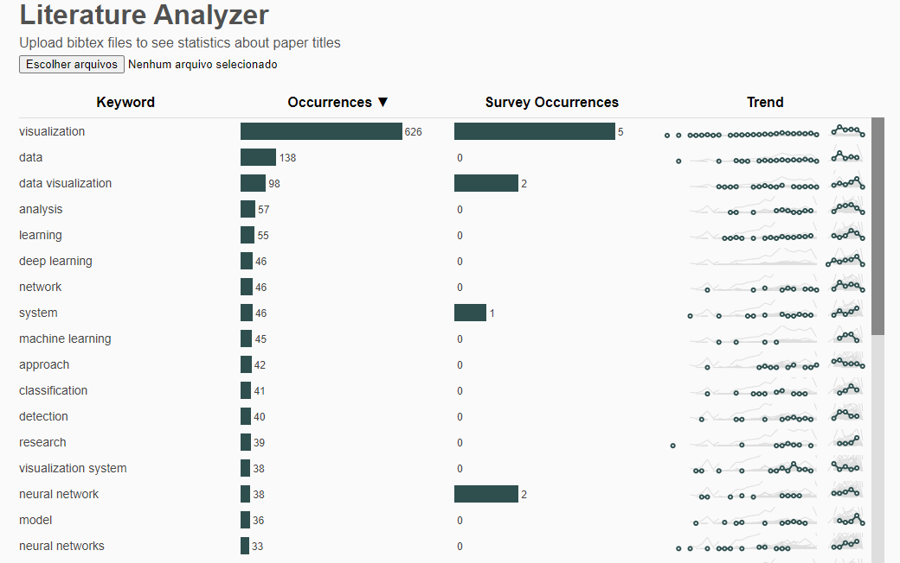
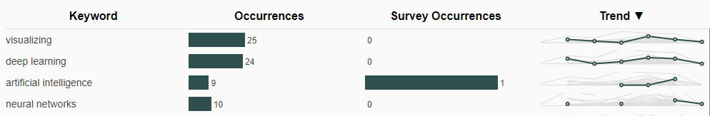
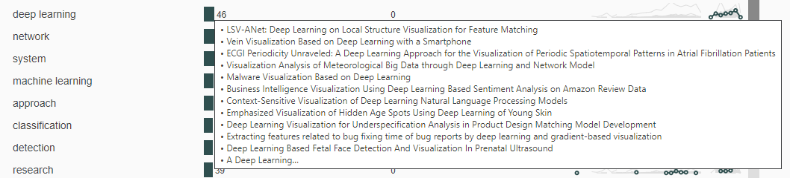
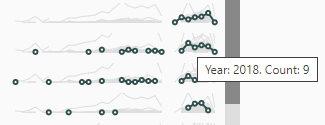

# Literature Analyzer


Literature Analyzer is a web application to analyze the titles of research papers.
The application can be found at
[https://rodrigodivino.github.io/literature-analyzer/](https://rodrigodivino.github.io/literature-analyzer/)

The user inputs BibTeX files and the application detects common keywords,
computing statistics to provide an overview of the overall themes found in the papers
and how the themes evolved over time.

# How to Use

The input is a BibTeX file or a set of BibTeX files.
If multiple files are provided,
they are treated as a single BibTeX file with all the entries combined.

Users can gather BibTeX using their favourite bibliographic management tool.

# Keyword Detection

The application uses only the titles of the papers for keyword detection. 

After removing stop words (e.g., "of", "the") and move all words to lower case,
the application creates the unigrams, bigrams, and trigrams of each title.

For example the title ```Literature Analyzer Application``` produces the following candidate keywords: 
```Literature```, ```Analyzer```, ```Application``` (the unigrams), 
```Literature Analyzer```, ```Analyzer Application``` (the bigrams),
and ```Literature Analyzer Application``` (the trigram).


The n-grams that appears in more than 1% of titles become keywords.
The full set of unique keywords are then counted against each title to compute occurrence statistics.

If a keyword is found in a title, the associated sub-keywords are not counted.
For example, if a body of papers produces both "Deep Learning" and "Learning" as keywords,
a paper "Deep Learning Technique" will count only towards the longest keyword (in this case, "Deep Learning"),
and will not count towards sub-keywords (in this case, "Learning").

- **Occurrences:** How many titles contain the keyword.
- **Occurrences in Surveys:** How many titles contain both the keyword and the term "Survey".
- **Occurrence over Time (Trend):** How many titles in each year contain the keyword.

# Visualization

The values are plotted in a table and can be sorted by each column.



Hovering a bar will show some titles associated with the count: 



Hovering a dot in the line shows the year and count: 




